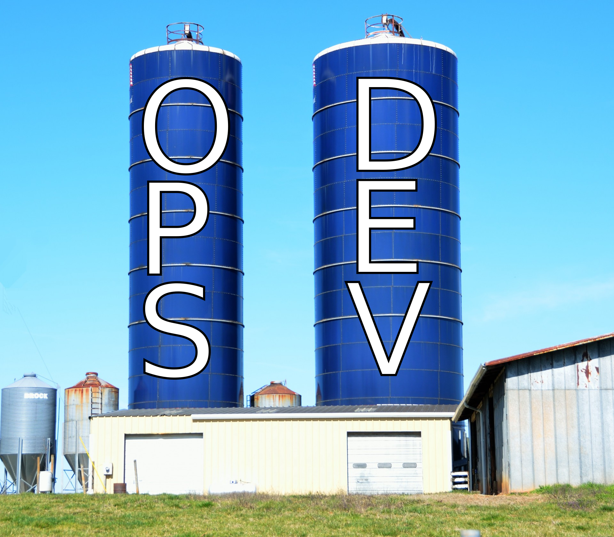
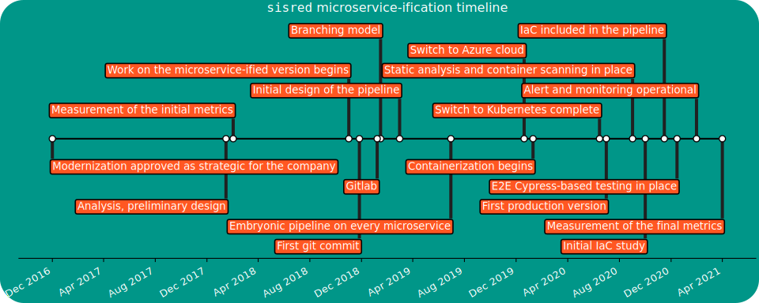

 +++

title = "Software Engineering Module 3: Introduction to agile and DevOps"
description = "Introduction to agile and DevOps, a case from the literature, SCRUM"
outputs = ["Reveal"]

+++

# Software Engineering
### **(for Intelligent Distributed Systems)**
# Module 3: DevOps

## *Introduction to agile and DevOps*

---

# Development

* Analysis of a domain
* Design of a solution
* Implementation
* Testing

---

# Operations

* IT infrastructure
* Deployment
* Maintenance

---

# Silo mentality

---

# **No** silos

---

# DevOps culture

* **Increased collaboration**
  * Dev and Ops should *exchange information* and *work together*

* **Shared responsibility**
  * A team is responsible for the (sub) product for its *whole lifetime*
  * *No handing over* projects from devs to ops

* **Autonomous teams**
  * *Lightweight decision making* process

* **Focus on the process, not just the product**
  * Promote small, *incremental changes*
  * *Automate* as much as possible
  * Leverage the right *tool* for the job at hand

---

# Why bother?

1. **Risk management**
    * Reduce the probability of *failure*
    * Detect *defects* before hitting the market
    * Quickly *react* to problems

2. **Resource exploitation**
    * Use *human resources* for human-y work
    * Reduce *time to market*
    * Embrace *innovation*
    * Exploit *emerging technologies*

---

# DevOps

1. **Principles**
2. **Practices**
3. **Tools**

**Principles** *inspire* **practices**

**Practices** *require* **tools**

---

# DevOps principles
### (not exhaustive)

* Collaboration
* Reproducibility
* Automation
* Incrementality
* Robustness

---

# DevOps practices

* Workflow organization
* Build automation
* Self-testing code
* Code quality control
* Continuous Integration
* Continuous Delivery
* Continuous Deployment
* Continuous Monitoring

---

# A real-world test case

We applied DevOps (and microservice-ification) to an existing software project,
measuring some metrics *before* and *after* the operation.

* The detailed *experience report* has been presented at the 37th International Conference on Software Maintenance and Evolution ([ICSME 2021](https://icsme2021.github.io/)) 
    * [Scientific paper](https://doi.org/10.1109/ICSME52107.2021.00051)

---

<iframe width="1280" height="720" src="https://www.youtube.com/embed/6qd6GG3XQXA" title="YouTube video player" frameborder="0" allow="accelerometer; autoplay; clipboard-write; encrypted-media; gyroscope; picture-in-picture" allowfullscreen></iframe>

---

## The target

### Maggioli S.p.A

* *Multinational*, based in Italy
* *~2000 collaborators* at the time of writing
* An *internal IT/Operations* team
* Our target team was composed of **five people**

### sisred (before intervention)

* *Client-server* stand-alone application
* *Delphi* front-end, *Microsoft SQL Server* backend
* Editors (paid by Maggioli) are *experts in law entering information on the client*
* The information is the exposed into a (paid access) *portal* with up-to-date legal information

---

## Previous architecture

---

#

| Metric         | Prev.           | Now  | Change |
| :-------------|:-------------:| :-----:| ---: |
| Release frequency ($\frac{releases}{day}$) | [0.071]() | 
| Commit to release time (hours) |   [8 to 24]() | 
| Commits per day ($\frac{commits}{day}$) | [2]() | 
| MTTR (hours) | [36]() | 
| Prod. env. setup (working hours) | [16]() | 
| Dev. env. setup (minutes) | [120]() |
| Nightly downtime ($\frac{minutes}{night}$) | [30]() | 
| Support ticket frequency ($\frac{tickets}{month}$) | [40]() | 
| Issue resolution time (days) | [4]() |  | 

---

## Microservice-ified architecture

---

## CI Pipeline

---



| Metric         | Prev.           | Now  | Change |
| :-------------|:-------------:| :-----:| ---: |
| Release frequency ($\frac{releases}{day}$) | [0.071]() | *2.7* | **+3700%**
| Commit to release time (hours) |   [8 to 24]() | 
| Commits per day ($\frac{commits}{day}$) | [2]() | 
| MTTR (hours) | [36]() | 
| Prod. env. setup (working hours) | [16]() | 
| Dev. env. setup (minutes) | [120]() |
| Nightly downtime ($\frac{minutes}{night}$) | [30]() | 
| Support ticket frequency ($\frac{tickets}{month}$) | [40]() | 
| Issue resolution time (days) | [4]() |  | 

---



| Metric         | Prev.           | Now  | Change |
| :-------------|:-------------:| :-----:| ---: |
| Release frequency ($\frac{releases}{day}$) | [0.071]() | *2.7* | **+3700%**
| Commit to release time (hours) |   [8 to 24]() | *0.19* | **~ -98.5%**
| Commits per day ($\frac{commits}{day}$) | [2]() | 
| MTTR (hours) | [36]() | 
| Prod. env. setup (working hours) | [16]() | 
| Dev. env. setup (minutes) | [120]() |
| Nightly downtime ($\frac{minutes}{night}$) | [30]() | 
| Support ticket frequency ($\frac{tickets}{month}$) | [40]() | 
| Issue resolution time (days) | [4]() |  | 

---



| Metric         | Prev.           | Now  | Change |
| :-------------|:-------------:| :-----:| ---: |
| Release frequency ($\frac{releases}{day}$) | [0.071]() | *2.7* | **+3700%**
| Commit to release time (hours) |   [8 to 24]() | *0.19* | **~ -98.5%**
| Commits per day ($\frac{commits}{day}$) | [2]() | *7.1* | **+255%**
| MTTR (hours) | [36]() | 
| Prod. env. setup (working hours) | [16]() | 
| Dev. env. setup (minutes) | [120]() |
| Nightly downtime ($\frac{minutes}{night}$) | [30]() | 
| Support ticket frequency ($\frac{tickets}{month}$) | [40]() | 
| Issue resolution time (days) | [4]() |  | 

---



| Metric         | Prev.           | Now  | Change |
| :-------------|:-------------:| :-----:| ---: |
| Release frequency ($\frac{releases}{day}$) | [0.071]() | *2.7* | **+3700%**
| Commit to release time (hours) |   [8 to 24]() | *0.19* | **~ -98.5%**
| Commits per day ($\frac{commits}{day}$) | [2]() | *7.1* | **+255%**
| MTTR (hours) | [36]() | *0.5* | **-98.6%**
| Prod. env. setup (working hours) | [16]() | 
| Dev. env. setup (minutes) | [120]() |
| Nightly downtime ($\frac{minutes}{night}$) | [30]() | 
| Support ticket frequency ($\frac{tickets}{month}$) | [40]() | 
| Issue resolution time (days) | [4]() |  | 

---



| Metric         | Prev.           | Now  | Change |
| :-------------|:-------------:| :-----:| ---: |
| Release frequency ($\frac{releases}{day}$) | [0.071]() | *2.7* | **+3700%**
| Commit to release time (hours) |   [8 to 24]() | *0.19* | **~ -98.5%**
| Commits per day ($\frac{commits}{day}$) | [2]() | *7.1* | **+255%**
| MTTR (hours) | [36]() | *0.5* | **-98.6%**
| Prod. env. setup (working hours) | [16]() | *0.35* | **-97.8%**
| Dev. env. setup (minutes) | [120]() |
| Nightly downtime ($\frac{minutes}{night}$) | [30]() | 
| Support ticket frequency ($\frac{tickets}{month}$) | [40]() | 
| Issue resolution time (days) | [4]() |  | 

---



| Metric         | Prev.           | Now  | Change |
| :-------------|:-------------:| :-----:| ---: |
| Release frequency ($\frac{releases}{day}$) | [0.071]() | *2.7* | **+3700%**
| Commit to release time (hours) |   [8 to 24]() | *0.19* | **~ -98.5%**
| Commits per day ($\frac{commits}{day}$) | [2]() | *7.1* | **+255%**
| MTTR (hours) | [36]() | *0.5* | **-98.6%**
| Prod. env. setup (working hours) | [16]() | *0.35* | **-97.8%**
| Dev. env. setup (minutes) | [120]() | *9* | **-92.5%**
| Nightly downtime ($\frac{minutes}{night}$) | [30]() | 
| Support ticket frequency ($\frac{tickets}{month}$) | [40]() | 
| Issue resolution time (days) | [4]() |  | 

---



| Metric         | Prev.           | Now  | Change |
| :-------------|:-------------:| :-----:| ---: |
| Release frequency ($\frac{releases}{day}$) | [0.071]() | *2.7* | **+3700%**
| Commit to release time (hours) |   [8 to 24]() | *0.19* | **~ -98.5%**
| Commits per day ($\frac{commits}{day}$) | [2]() | *7.1* | **+255%**
| MTTR (hours) | [36]() | *0.5* | **-98.6%**
| Prod. env. setup (working hours) | [16]() | *0.35* | **-97.8%**
| Dev. env. setup (minutes) | [120]() | *9* | **-92.5%**
| Nightly downtime ($\frac{minutes}{night}$) | [30]() | *0* | **-100%**
| Support ticket frequency ($\frac{tickets}{month}$) | [40]() | 
| Issue resolution time (days) | [4]() |  | 

---



| Metric         | Prev.           | Now  | Change |
| :-------------|:-------------:| :-----:| ---: |
| Release frequency ($\frac{releases}{day}$) | [0.071]() | *2.7* | **+3700%**
| Commit to release time (hours) |   [8 to 24]() | *0.19* | **~ -98.5%**
| Commits per day ($\frac{commits}{day}$) | [2]() | *7.1* | **+255%**
| MTTR (hours) | [36]() | *0.5* | **-98.6%**
| Prod. env. setup (working hours) | [16]() | *0.35* | **-97.8%**
| Dev. env. setup (minutes) | [120]() | *9* | **-92.5%**
| Nightly downtime ($\frac{minutes}{night}$) | [30]() | *0* | **-100%**
| Support ticket frequency ($\frac{tickets}{month}$) | [40]() | *19* | **-52.5%**
| Issue resolution time (days) | [4]() |  | 

---



| Metric         | Prev.           | Now  | Change |
| :-------------|:-------------:| :-----:| ---: |
| Release frequency ($\frac{releases}{day}$) | [0.071]() | *2.7* | **+3700%**
| Commit to release time (hours) |   [8 to 24]() | *0.19* | **~ -98.5%**
| Commits per day ($\frac{commits}{day}$) | [2]() | *7.1* | **+255%**
| MTTR (hours) | [36]() | *0.5* | **-98.6%**
| Prod. env. setup (working hours) | [16]() | *0.35* | **-97.8%**
| Dev. env. setup (minutes) | [120]() | *9* | **-92.5%**
| Nightly downtime ($\frac{minutes}{night}$) | [30]() | *0* | **-100%**
| Support ticket frequency ($\frac{tickets}{month}$) | [40]() | *19* | **-52.5%**
| Issue resolution time (days) | [4]() | *3* | **-25%**

---

## Benefits

* Much less **maintenance** in the traditional meaning: *"Time spent to keep the system in nominal conditions"*
    * No more issues with Windows updates
    * No more downtimes related to internal network / electricity / public infrastructure maintenance
    * Improved security
    * No more critical failures caused by testing stored procedures directly in production my mistake
* Much more maintenance in terms of *software evolution*
    * Application (or verification of automatic application) of updates
    * Security audits
    * Maintenance and update of the pipeline

---

## Lessons learned

* The teams must be **autonomous**
* Practices must be *tailored* to the team
* Time-consuming, repetitive, and cumbersome procedures must be *automated*
* Obsolete practices must be *removed*
* **Communication** is key, awareness must be shed across the team of the expected benefits

---

## Timeline

---

# Agile software development

## [Manifesto](http://agilemanifesto.org/)

We are uncovering better ways of developing software by doing it and helping others do it. Through this work we have come to value:

* **Individuals and interactions** over *processes and tools*
* **Working software** over *comprehensive documentation*
* **Customer collaboration** over *contract negotiation*
* **Responding to change** over *following a plan*

That is, while *there is value in the items on the right*, **we value the items on the left more**.

---

## [Agile Principles I](http://agilemanifesto.org/principles.html)
*(emphasis mine)*
**(comments mine)**

1. Our highest priority is to satisfy the customer
through early and *continuous delivery*
of valuable software.

2. Welcome *changing requirements*, even late in
development. Agile processes harness change for
the customer's *competitive advantage*.
**(Not an excuse for not collecting requirements upfront)**

3. *Deliver* working software *frequently*, from a
couple of weeks to a couple of months, with a
preference to the shorter timescale.
**(Daily, hourly)**

4. *Business people and developers must work together* daily throughout the project.
**(And understand each other!)**

5. Build projects around *motivated individuals*.
Give them the environment and support they need,
and *trust* them to get the job done.
**(Teams must be independent)**

6. The most efficient and effective method of
conveying information to and within a development
team is *face-to-face conversation*.
**(Yes, it is pre-covid stuff)**

---

## [Agile Principles II](http://agilemanifesto.org/principles.html)
*(emphasis mine)*
**(comments mine)**

7. *Working software* is the primary measure of progress.
**(But if used as the only measure progress, progress will halt soon)**

0. Agile processes promote *sustainable* development.
The sponsors, developers, and users should be able
to maintain a constant pace indefinitely.
**(Bureaucracy and maintenance task should not pile up)**

0. Continuous attention to *technical excellence*
and *good design* enhances agility.
**(First, do it well)**

0. Simplicity--the art of maximizing the amount
of work not done--is essential.
**(Also known as KISS)**

0. The best architectures, requirements, and designs
emerge from self-organizing teams.

0. At regular intervals, the team reflects on how
to become more effective, then tunes and adjusts
its behavior accordingly.
**(Or, maybe, continuously...)**

---

## Practices vs. Frameworks

**Principles** get reified into *practices*

**Practices** get often interpreted and formalized into *frameworks*

Framework are *actionable*, but formalization may introduce *assumptions about projects and teams that do not hold always!*

**Agile principles and practices** get often captured into these well-known frameworks, with slightly different focuses and goals:
* *Scrum*
    * focus on team structure, roles, responsibilities, procedures
* *Kanban*
    * focus on tasks, streamlining, bottleneck mitigation
* *XP (Extreme Programming)*
    * focuses on release frequency
* *Feature Driven Development*
    * focuses on the client requests and satisfaction
* *Crystal*
    * focuses on self-management of teams
* *DSDM (Dynamic Systems Development Method)*
    * focuses on time and budget constraints

---

# Scrum

Seminal paper from 1986 by Hirotaka Takeuchi and Ikujiro Nonaka:
* [The New New Product Development Game](https://hbr.org/1986/01/the-new-new-product-development-game)

Then refined to the current framework. The name is from Rugby's "scrummage"

---

## Scrum key ideas

* Requirements are *volatile*
* There will be *unpredictability* along the road
* Accept that the problem may not be fully understood upfront, and focus on *quick response* to unexpected changes

---

## Scrum workflow

* The development is divided in **Sprints**
* A Sprint is *timeboxed*: the length is agreed in advance
    * The most commonly adopted length is two weeks
* A Sprint must end with a *deliverable* advancement
* Each sprint is macro-structured as follows:
    1. *Planning*: define the activities of the sprint
    2. *Daily scrums* (aka "stand-up meetings"): daily updates on the state of work
    3. *Sprint review*: at the of the sprint, present the work to the stakeholders
* At regular intervals a *Sprint retrospective* is held
    * Reason on the past sprints with the goal of *continuous improvement*

---

## Scrum roles

* **Product owner (PO)**
    * *Goal*: maximimizing ROI
    * *Tasks*: identify the necessary features and prioritize them
    * *Vision*: strategic, similar to a product manager, but *understands the product development*!
    * *Interactions*: customers, development team, SM
    * *Responsibilities*: coarse-grained, high-level decision on product directions

* **Development team**
    * *Goal*: make things happen
    * *Tasks*: build the selected features, provide time estimates, provide feedback to the PO
    * *Vision*: tactic, cross-functional (T-shaped, the team can deal with all the aspects of a sub-project)
    * *Interactions*: PO and SM
    * *Responsibilities*: fine-grained, autonomous and hence accountable

* **Scrum master (SM)**
    * *Goal*: coaching and supervision
    * *Tasks*: explain Scrum, supervise its application, help learning the methodology
    * *Vision*: process-oriented, expert in Scrum
    * *Interactions*: PO and development team
    * *Responsibilities*: help the team understand and apply Scrum, no formal responsibility on the product.
      Optional (if the team is already experienced), often externalized.

---

## Scrum tools

* **Product backlog**
    * A *prioritized* list of *customer-driven* features
    * Maintained and sorted by the PO
    * Each item has an associated *size estimation* (in arbitrary measure)
    * Refined at the conclusion of each sprint
* **Sprint backlog**
    * *Refines* the product backlog
    * Each product backlog item selected for the current sprint gets split into *sprint tasks*
    * Each task has an *effort estimation*, an *assignee*, and a *progress tracker*
    * The progress is often tracked by updating the "remaining effort" day by day
        * The [burn-down chart](https://en.wikipedia.org/wiki/Burn_down_chart) is a common way to visualize it

---

### Product backlog

---

### Sprint backlog

---

---

## Key concept: **the definition of done**

Apparently simple concept that is *central* for Scrum to work

(and for many other workflows)

Every actor in the process **must agree** and what is the meaning of a task being considered **done**

* Is it done when the acceptance tests work?
* Is it done when the assignee marks it as so?
* Is it done when it is delivered to the main application?
* Is it done when it has been in production for at least one week without bug reports?

---

## Process overview

---

## Workflow overview

---

## The problem with Scrum

Scrum and agile are often used as *synonyms*, but **they are not**

In the literature, Scrum and agile show mixed evidence of efficacy

(even though, anecdotically, many success stories can be found)

### **WARNING: opinions!**

* From now on, facts are mixed with opinions of practitioners (included myself)
* There will be citations. Please note: many authors of these quotes, although regarded professionals, often use agile and Scrum interchangeably
* We are going to ask ourselves to what doesn't work, when, and why
* Let's see if we can find some general guidance...

---

> Waterfall replicates the social model of a dysfunctional organization with a defined hierarchy. Agile, quite often, replicates the social model of a dysfunctional organization *without* a well-defined hierarchy.

* Michael O. Church: [Why “Agile” and especially Scrum are terrible](https://michaelochurch.wordpress.com/2015/06/06/why-agile-and-especially-scrum-are-terrible/)

---

> If your team has combined agile with a legacy methodology such as waterfall, creating a 'water-scrum' approach, you may have the worst of both worlds: You have combined the rigid structure of the traditional approach with the terminology of agile.

* Peter Varhol: [8 reasons to ditch agile](https://techbeacon.com/app-dev-testing/8-reasons-ditch-agile)

---

<iframe id="reddit-embed" src="https://www.redditmedia.com/r/programming/comments/9wcku8/why_agile_and_especially_scrum_are_terrible/e9k4adq/?depth=1&amp;showmore=false&amp;embed=true&amp;showmedia=false" sandbox="allow-scripts allow-same-origin allow-popups" style="border: none;" height="158" width="640" scrolling="no"></iframe>
<iframe id="reddit-embed" src="https://www.redditmedia.com/r/programming/comments/9wcku8/why_agile_and_especially_scrum_are_terrible/e9kccas/?depth=1&amp;showmore=false&amp;embed=true&amp;showmedia=false" sandbox="allow-scripts allow-same-origin allow-popups" style="border: none;" height="139" width="640" scrolling="no"></iframe>
<iframe id="reddit-embed" src="https://www.redditmedia.com/r/programming/comments/9wcku8/why_agile_and_especially_scrum_are_terrible/e9kdpz8/?depth=1&amp;showmore=false&amp;embed=true&amp;showmedia=false" sandbox="allow-scripts allow-same-origin allow-popups" style="border: none;" height="139" width="640" scrolling="no"></iframe>
<iframe id="reddit-embed" src="https://www.redditmedia.com/r/programming/comments/9wcku8/why_agile_and_especially_scrum_are_terrible/e9ka6tj/?depth=1&amp;showmore=false&amp;embed=true&amp;showmedia=false" sandbox="allow-scripts allow-same-origin allow-popups" style="border: none;" height="139" width="640" scrolling="no"></iframe>
<iframe id="reddit-embed" src="https://www.redditmedia.com/r/programming/comments/9wcku8/why_agile_and_especially_scrum_are_terrible/e9kmbvv/?depth=1&amp;showmore=false&amp;embed=true&amp;showmedia=false" sandbox="allow-scripts allow-same-origin allow-popups" style="border: none;" height="139" width="640" scrolling="no"></iframe>
<iframe id="reddit-embed" src="https://www.redditmedia.com/r/programming/comments/9wcku8/why_agile_and_especially_scrum_are_terrible/e9kmbvv/?depth=1&amp;showmore=false&amp;embed=true&amp;showmedia=false" sandbox="allow-scripts allow-same-origin allow-popups" style="border: none;" height="139" width="640" scrolling="no"></iframe>

<iframe id="reddit-embed" src="https://www.redditmedia.com/r/programming/comments/9wcku8/why_agile_and_especially_scrum_are_terrible/e9kbutx/?depth=1&amp;showmore=false&amp;embed=true&amp;showmedia=false" sandbox="allow-scripts allow-same-origin allow-popups" style="border: none;" height="163" width="640" scrolling="no"></iframe>

---

<iframe id="reddit-embed" src="https://www.redditmedia.com/r/scrum/comments/t4fun4/query_from_a_sm_of_6_months/?ref_source=embed&amp;ref=share&amp;embed=true" sandbox="allow-scripts allow-same-origin allow-popups" style="border: none;" height="319" width="640" scrolling="no"></iframe>

---

> Many practice the terminology without appreciating the underlying values.

* Peter Varhol: [8 reasons to ditch agile](https://techbeacon.com/app-dev-testing/8-reasons-ditch-agile)

---

> I knew the end of Agile was coming when we started using hockey sticks.

* Kurt Cagle on Forbes: [The End of Agile](https://www.forbes.com/sites/cognitiveworld/2019/08/23/the-end-of-agile/?sh=1bee770a2071)

---

> If management is essentially ignoring the developers, there are fixed deadlines to be achieved with a predefined scope, or it's a dog-eat-dog environment instead of a team focused on achieving the same goal, if planning ahead and thinking out of the box are not appreciated, then yes, eventually you'll give up and resort to just doing the assigned tasks. I've been there.

* From [StackOverflow](https://softwareengineering.stackexchange.com/questions/410482/how-do-i-prevent-scrum-from-turning-great-developers-into-average-developers/410484#410484)

---

> **Standup is effectively "update management".** The notion that standup is for developers is absurd. Does anyone actually wait until 9AM to report a problem or are they going to just ask in the group chat immediately? In practice, it is someone higher up the food chain keeping tabs on how fast things are moving so they can ask about it later in the day.

* Matthew Gaiser [on StackOverflow](https://softwareengineering.stackexchange.com/a/410492/337842)

---

> it usually bends and breaks every other process to it and becomes this overarching process where you do nothing consistently except Scrum rituals and making those Scrum rituals seem successful

* Matthew Gaiser [on StackOverflow](https://softwareengineering.stackexchange.com/a/410492/337842)

---

# What is the root of these issues?

---

## Bureaucratization

* There is a very delicate trade-off between *standardization* of practices and *excess of buraucracy*
* Agile is designed around *co-located medium/small teams* and *low buraucracy* (compared to the state of the art at the time)
* Larger scale requires more coordination and buraucracy
* Smaller scale benefits of less buraucracy

> There is no one-fits-them-all workflow!

**Blindly adopting a pre-existing set of practices may lead to failures**

**Mixing cherry-picked parts of workflows requires a great deal of experience**
* It is paramount that everyone understands *why* some procedure is in place

---

> **It’s stupidly, dangerously short-term.** Agile is designed for and by consulting firms that are marginal. That is, it’s for firms that don’t have the credibility that would enable them to negotiate with clients as equals, and that are facing tight deadlines while each client project is an existential risk. It’s for “scrappy” underdogs.

* Michael O. Church: [Why “Agile” and especially Scrum are terrible](https://michaelochurch.wordpress.com/2015/06/06/why-agile-and-especially-scrum-are-terrible/)

---

> **Two-week delivery schedules are overkill**

* Peter Varhol: [8 reasons to ditch agile](https://techbeacon.com/app-dev-testing/8-reasons-ditch-agile)

---

# TIME BOXEs

---

Abuso delle metriche / KPI

> Great developers are often sought out for advice and for second opinions. But any time doing that is less time spent churning out tickets, so their velocity falls.

* Matthew Gaiser [on StackOverflow](https://softwareengineering.stackexchange.com/a/410492/337842)

---

> Scrum and infinite defects can be good friends because the infinite defects approach lets velocity be artificially high as long as bugs are found after the sprint and therefore counted as new work. You could have an ever higher velocity by constantly generating new bugs.

* Matthew Gaiser [on StackOverflow](https://softwareengineering.stackexchange.com/a/410492/337842)

---

> Because the developers are independently working away on each ticket sequentially, the architecture rapidly begins to mirror the tickets. The tickets are typically 1-2 sentence user stories. Ticket driven architecture rapidly gets messy simply because more code gets piled on as required.

* Matthew Gaiser [on StackOverflow](https://softwareengineering.stackexchange.com/a/410492/337842)

---

Valorizzazione del team

> I call this the *Whisky Goggles Effect*: it turns the 3s and 4s into 5s, but it makes you so sloppy that the 7s and 9s want nothing to do with you. Unable to get their creative juices flowing under a system where everything has to be justified in terms of short-term business value, the best programmers leave.

* Michael O. Church: [Why “Agile” and especially Scrum are terrible](https://michaelochurch.wordpress.com/2015/06/06/why-agile-and-especially-scrum-are-terrible/)

*[Emphasis mine]*

---

Valorizzazione del team

> Culturally, agile may threaten some team members, including those who feel they had obtained an informal leadership status under the previous process that disappeared under agile.

* Peter Varhol: [8 reasons to ditch agile](https://www.reddit.com/r/programming/comments/9wcku8/comment/e9lcdaf/?utm_source=share&utm_medium=web2x&context=3)

(no, it's not)

---

<iframe id="reddit-embed" src="https://www.redditmedia.com/r/programming/comments/9wcku8/why_agile_and_especially_scrum_are_terrible/e9lcdaf/?depth=2&amp;showmore=false&amp;embed=true&amp;showtitle=true&amp;context=1&amp;showmedia=false" sandbox="allow-scripts allow-same-origin allow-popups" style="border: none;" height="411" width="640" scrolling="no"></iframe>

> The first sign that things are going to go poorly is when you learn management will attend your standup.

* A random user [`r/programming`](https://techbeacon.com/app-dev-testing/8-reasons-ditch-agile)

---

<iframe id="reddit-embed" src="https://www.redditmedia.com/r/programming/comments/9wcku8/why_agile_and_especially_scrum_are_terrible/e9kclup/?depth=1&amp;showmore=false&amp;embed=true&amp;showmedia=false" sandbox="allow-scripts allow-same-origin allow-popups" style="border: none;" height="236" width="640" scrolling="no"></iframe>

---

> developers who think they are under pressure will do a crappy job in any development methodology

* From [StackOverflow](https://softwareengineering.stackexchange.com/a/410494/337842)

---

> Great developers are usually defined as those who can solve tough problems. Scrum encourages picking work that can easily be done and rapidly churned out at a steady pace. A tough problem is a developer being slow on getting the tickets done.

* Matthew Gaiser [on StackOverflow](https://softwareengineering.stackexchange.com/a/410492/337842)

---

> Teams might self organize if they all have the same goal and incentives. The problem is, that is rarely true. One guy wants a promotion. Another is studying for a degree on the side. A third is upskilling to go to another company. Another just doesn't want to have arguments so agrees to anything and lets the codebase become a mess. A lot of good design requires the developers to sit down and hash out how a thing should work.

* Matthew Gaiser [on StackOverflow](https://softwareengineering.stackexchange.com/a/410492/337842)

---

> Even if you get a situation where you are not formally judged on the points completed (which will not happen if management is mostly interacting during Scrum rituals as that is all they have to see regarding progress), people are still going to compete for attention and rewards.

* Matthew Gaiser [on StackOverflow](https://softwareengineering.stackexchange.com/a/410492/337842)

---

Marketing over workflow

> Many practice the terminology without appreciating the underlying values.

* Peter Varhol: [8 reasons to ditch agile](https://techbeacon.com/app-dev-testing/8-reasons-ditch-agile)

---

> If you really don't have an agile methodology but call it agile to attract and retain developers and other team members, you are in trouble.

* Peter Varhol: [8 reasons to ditch agile](https://techbeacon.com/app-dev-testing/8-reasons-ditch-agile)

---

Knowledge gaps // technical excellence

QA should enforce rules bey testing

> In Scrum, you need to clear tickets and there is no real check on the quality of the work as "done" or "not done" is decided by a usually non-technical project owner. That incentivizes going into a void and focusing on outputting code.

* Matthew Gaiser [on StackOverflow](https://softwareengineering.stackexchange.com/a/410492/337842)

---

> The high level of developer independence means each developer takes different approaches. [...] While it is not necessarily wrong, it makes debugging a heck of a lot harder as more places need to be checked.

* Matthew Gaiser [on StackOverflow](https://softwareengineering.stackexchange.com/a/410492/337842)

---

know your team

know your project

beware of the marketing

post agile?
